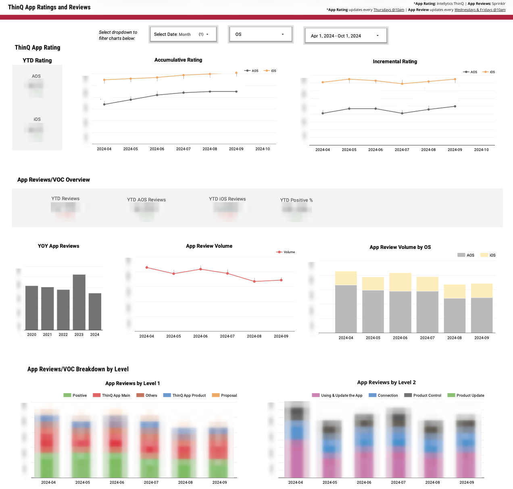
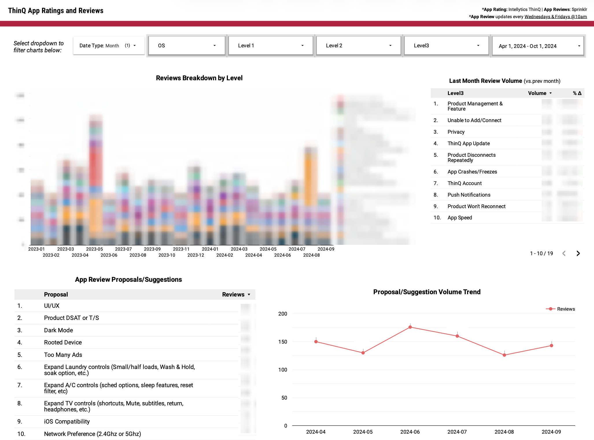

# App Rating & Reviews
# App Ratings & Reviews (VOC Pipeline)

## Overview

Built a SQL pipeline to process and structure app ratings and customer reviews (VOC) data for dashboard reporting. This pipeline standardizes raw review data from multiple sources and enables analysis of app performance, user feedback, and issue trends.

## Dashboard

## Context

App ratings and customer reviews were stored in raw, unstructured formats with inconsistent category labels and multiple nested fields. This made it difficult to:

* analyze trends over time
* identify recurring product issues
* compare feedback across iOS and Android

## Approach

* Processed raw review data from multiple input fields (A/B/C case structures) into a unified format

* Standardized platform mapping:

  * iOS (Apple)
  * AOS (Google Play)

* Cleaned and normalized hierarchical categories:

  * Level 1 (high-level category)
  * Level 2 (sub-category)
  * Level 3 (detailed issue)

* Handled inconsistencies such as:

  * null / empty values
  * duplicated or misnamed categories (e.g., “Product SW Udate” → “Product SW Update”)

* Generated time-based labels to support dashboard filtering:

  * monthly (`YYYY-MM`)
  * weekly (`YYYY W##`)

## Output

Produced structured tables used in dashboard visualizations, including:

* app rating trends over time (iOS vs AOS)
* review volume trends
* breakdown of issues by category (Level 1/2/3)
* top recurring user-reported problems

## Key SQL Concepts

* Data normalization across multiple raw fields
* Conditional logic (`CASE WHEN`) for category standardization
* Union of multiple input structures into a single dataset
* Time-based aggregation using `DATE_TRUNC`, `FORMAT_TIMESTAMP`

## Files

* `app_reviews_pipeline.sql` — SQL pipeline for app rating and review processing
