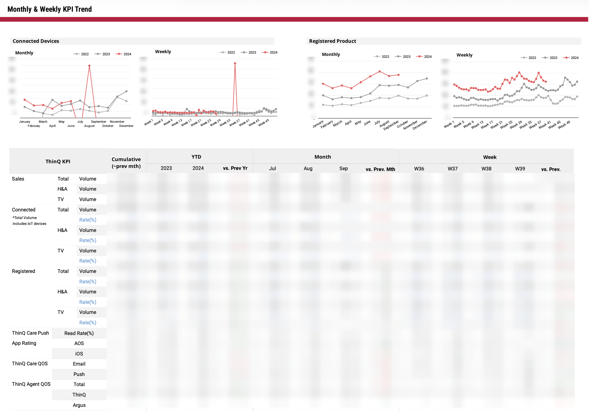
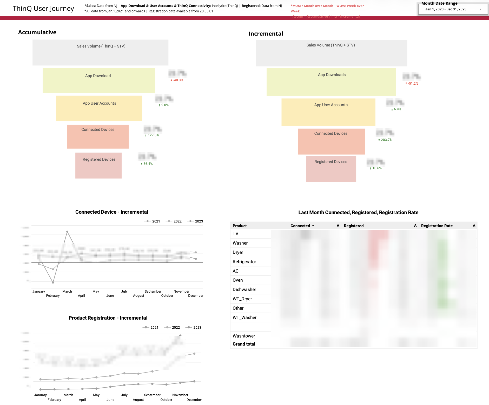

# KPI Tracking Dashboard (Executive Reporting)

## Overview

Built a SQL-based KPI pipeline and dashboard used for monthly and weekly executive reporting. This replaced static Excel reports and is used during leadership meetings to review performance and drill into specific metrics.

## Dashboard

## Context

Previously, KPI reporting was delivered through manually prepared Excel files. This made it difficult to:

* quickly navigate across metrics during meetings
* investigate changes in real time
* maintain consistent metric definitions

## Solution

Developed a centralized KPI dashboard backed by SQL pipelines that standardize and aggregate key business metrics.

The dashboard is used live during executive meetings, allowing leadership to move between views and explore metrics in detail when questions arise.

## Metrics Covered

The KPI system includes:

* **Sales** (volume)
* **Connected Devices** (volume, connection rate)
* **Registered Devices** (volume, registration rate)
* **Push Notifications** (read rate)
* **App Ratings** (AOS, iOS)
* **Customer Care QOS** (email, push)
* **Agent Performance QOS**

Metrics are tracked across:

* product groups (Total, TV, H&A)
* monthly and weekly timeframes

## Approach

* Built SQL pipelines to aggregate and standardize metrics across multiple data sources
* Created consistent definitions for volume and rate-based KPIs
* Used window functions (`SUM OVER`, `LAG`) to compute:

  * cumulative values
  * week-over-week and month-over-month changes
* Structured outputs to support flexible dashboard navigation during meetings

## Impact

* Replaced manual Excel-based reporting with a centralized dashboard
* Enabled real-time discussion and analysis during executive reviews
* Improved consistency and accessibility of KPI reporting across teams

## Files

* `kpi_pipeline.sql` — core SQL logic for KPI aggregation (sales, connected, registered)
