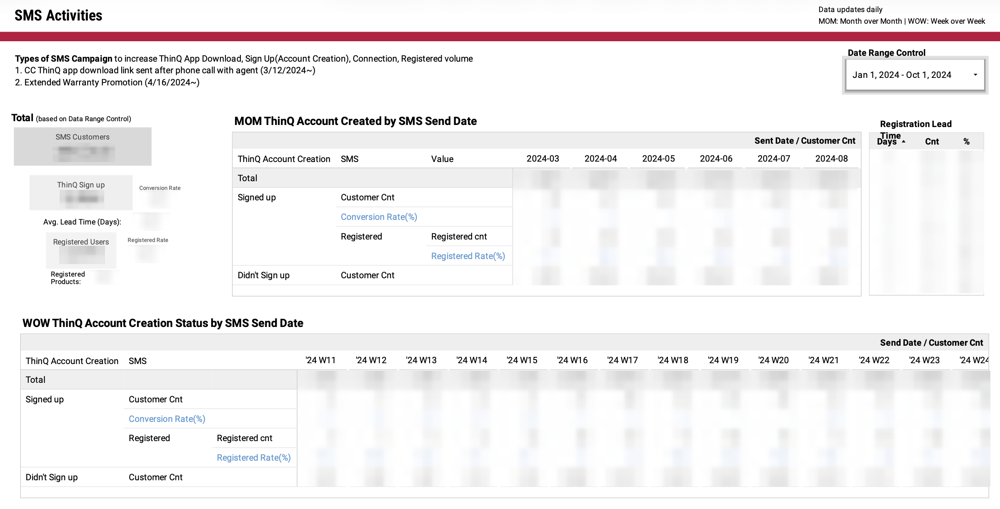

# SMS Campaign

## Overview

Built a SQL pipeline to track user conversion from SMS campaigns to app account signup, product connection and registration. The pipeline attributes downstream user actions to SMS activity and enables measurement of campaign effectiveness.

## Business Problem

Campaign performance could not be accurately measured:

* No attribution across channels (SMS, email, app, call center)
* Reliance on aggregate trends rather than actual conversion
* No ability to compare campaign effectiveness

## Solution

Developed a pipeline to link campaign exposure to downstream user actions.

### Key Components

* User-level attribution using time windows
* Funnel tracking (SMS → Signup → Connection → Registration)
* Deduplication and identity matching
* KPI generation (conversion rates, time-to-conversion)

## Output & Usage

* Enabled comparison of campaign performance across channels
* Identified high-performing messaging strategies
* Supported rapid iteration by modifying SMS content
  
### Dashboard

  

## Impact

* Introduced reliable and repeatable method to measure campaign impact
* Enabled data-driven campaign optimization
* Shifted campaign strategy from assumption-based to measurable experimentation

## Key SQL Concepts

* Attribution modeling
* Window functions (`RANK`)
* Conditional aggregation
* Time-based analysis

## Files

* `sms_pipeline.sql`
