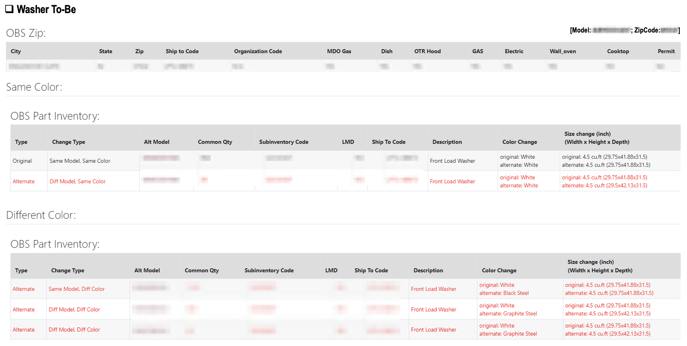
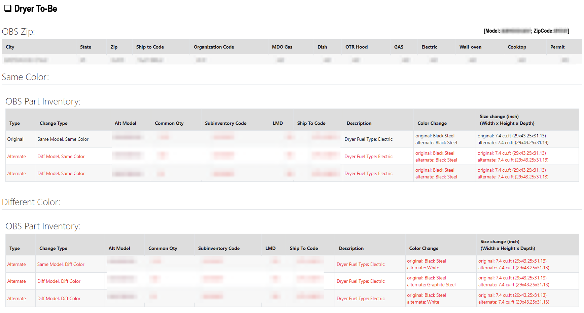

# Exchange Recommendation Engine

## Overview
Built a SQL-based recommendation engine to optimize product exchange decisions and reduce unnecessary buybacks.
This system was developed as part of an executive-sponsored initiative and integrated into an internal tool used by call center agents to guide real-time exchange decisions across multiple product categories.

## Business Problem
- High buyback rate (~71%) compared to exchanges (~29%)
- No standardized method to recommend alternative products
- Need to incorporate the daily changes in inventory at each designated warehouse
- Manual and inconsistent decision-making across agents and product groups

## Challenge: Schema Complexity
The most complex part of this project was data normalization. Model naming patterns changed every year and varied by product group (e.g., 2021 Washers vs. 2023 Washer; 2024 Dryers vs. 2024 Refrigerators).
- Strategy: implement Regex parser in SQL after identify naming patters within each product group
- Result: Successfully extracted 10+ attributes (Series, Capacity, Year) from unstructured strings, making the engine "future-proof" for new model releases

## Solution
Developed a recommendation system that generates **top 5 alternative products per model** based on structured similarity logic and business constraints.

The system supports:
- Refrigerator, Washer, Dryer, WashTower, Microwaves, and TV
- Same-color and different-color recommendations
- Inventory-aware decision making

## Recommendation Logic

### Search Criteria
- **Price Range**: -$100 to +$300 from original product  
- **Capacity / Size**:
  - Appliances: comparable capacity  
  - TV: screen size ≥ original  
- **Dimensions**: within ±1 inch (W × H × D)  
- **Product Type**: must match category (e.g., French Door, Top Load, OLED)  
- **Color Options**: same or different  

### Ranking Priority
#### Home Appliances (H&A)
1. Same product type  
2. Same color  
3. Price proximity  
4. Capacity / dimension similarity  

#### TV
1. Same product type  
2. Equal or larger screen size  
3. Price proximity  

## Approach
### 1. Feature Engineering
- Extracted structured attributes from model names using pattern matching (REGEXP)
- Standardized product types, capacity, and model groupings

### 2. Candidate Filtering
- Filtered valid alternatives based on:
  - price range
  - product compatibility
  - dimension constraints
  - inventory availability

### 3. Ranking & Selection
- Applied prioritization logic using SQL window functions
- Generated **top 5 ranked alternatives per product** based on inventory availablity at each designated warehouse.

## System Flow

The recommendation engine follows a structured pipeline from raw product data to agent-facing output:

```text
[Product Data]
      ↓
[Feature Engineering]
      ↓
[Candidate Filtering]
      ↓
[Ranking Logic]
      ↓
[Top 5 Recommendations]
      ↓
[Agent View (UI)]
```

## Example Output (Agent View)

The recommendation engine is at the backend and output tables are called in the frontend consultation screen used by call center agents.

### Washer Example


### Dryer Example


- Displays top alternative models based on similarity logic  
- Highlights differences in product type, size, and color
- Incorporates customer preference (prioritize same color vs. prioritize same dimensions)  
- Enables faster and more consistent exchange decisions  

## Impact
- Increased exchange rate from **29% → 45%** (+16pp)
- Reduced unnecessary buybacks
- Estimated **~$151K monthly cost savings**
- Standardized decision-making across product categories

## Tech Stack
- SQL (BigQuery)
- Data modeling & transformation
- Window functions & ranking logic

## Notes
- Raw data are not included due to data privacy policies  
- Product identifiers and sensitive fields have been anonymized  
- Logic and structure are preserved to demonstrate system design and SQL capability
