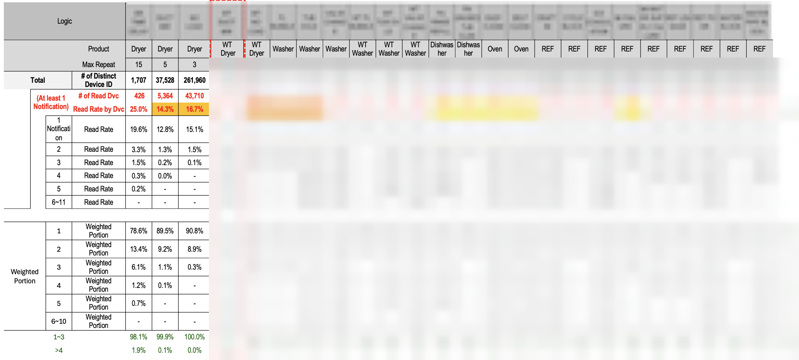

# Push Notification Optimization

## Overview

Analyzed 2.9M+ push notifications over a 2-year period to identify engagement gaps and redesign notification strategy, resulting in a **76% increase in read rates**.

Led a cross-functional effort across inventory, customer care, digital experience, and parts teams to improve notification effectiveness and user engagement.

---

## Business Problem

ThinQ Care sends proactive push notifications for appliance maintenance (e.g., dryer duct cleaning, water temperature issues, filter replacement).

Despite their importance, engagement was consistently low.

Key challenges:

* Repeated notifications with declining engagement
* No visibility into user-level exposure or behavior over time
* Low perceived urgency and unclear messaging

---

## Data Challenges

* Raw data distributed across multiple large CSV files (not Excel-readable)
* Mixed encodings (UTF-8 / UTF-16)
* Granular and inconsistent diagnosis codes
* No standardized product or engagement labels

---

## Data Processing (Python)

Built a preprocessing pipeline to structure large-scale notification data for analysis:

* Ingested and consolidated multi-file datasets using Python (Pandas)
* Standardized product categories across 7 appliance types
* Grouped 20+ diagnosis codes into unified notification logic categories
* Derived engagement status (read vs. unread) from delivery data
* Engineered time-based features (month, year, YYYYMM)
* Filtered known bad data window (Feb 5–17, 2024)

---

## Analysis & Key Insights

### Notification Fatigue

* Read rates declined significantly with repeated exposure
* Engagement dropped sharply after ~3 consecutive notifications

### Low Baseline Engagement

* Many notification types had read rates below 17%
* Performance varied significantly across notification logic types

### Detection vs. Action Gap

* System accurately detected issues
* Users often ignored notifications due to:

  * unclear instructions
  * low urgency
  * notification overload

---

## Example Analysis Output

Below is a representative structure of the analysis used to evaluate notification performance across logic types.

Note:

* Logic names and sensitive fields are anonymized
* Device counts and structure reflect real production-scale data

---

## Validation & User Research

* Designed and conducted 2 rounds of customer surveys (~4K total responses)

* Identified primary drivers of disengagement:

  * high notification volume across apps and devices
  * unclear messaging and lack of actionable guidance

* Conducted field validation (10 customers) to confirm:

  * diagnostic accuracy
  * disconnect between detection and user response

---

## Solution

Implemented system-level optimizations:

* Suppression logic to reduce repeated notifications
* Content redesign to improve clarity and actionability
* Time zone–based delivery optimization
* Notification grouping to reduce notification overload

---

## Impact

* **76% increase in push notification read rate**

---

## Tech Stack

* Python (Pandas)
* Data preprocessing and transformation
* Behavioral analysis

---

## Note

* Raw data and full analysis are not included due to confidentiality
* This repository focuses on the preprocessing and analytical foundation of the project
