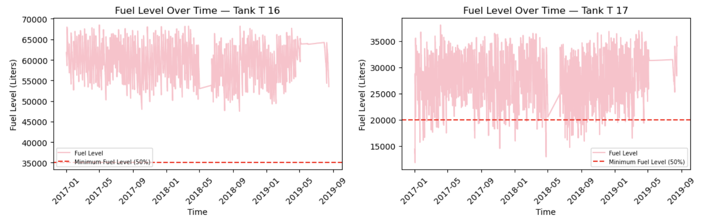
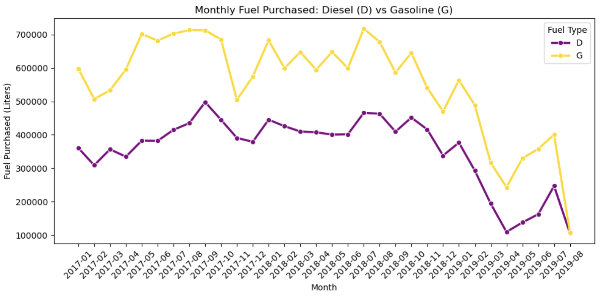
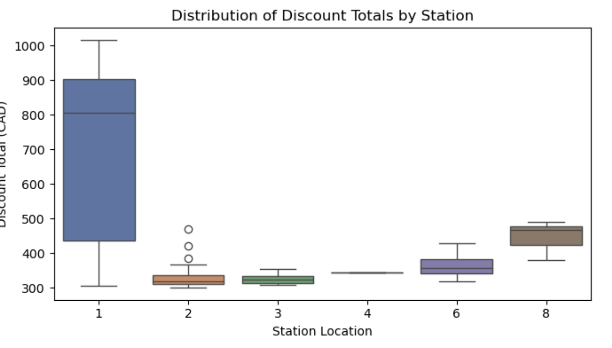

# Gas Station Inventory Optimization

## Overview

Analyzed fuel inventory and purchasing behavior across multiple gas stations to identify inefficiencies in replenishment strategy and quantify cost-saving opportunities through optimized ordering decisions.

This project focuses on balancing inventory levels with supplier discount thresholds to reduce purchasing costs while maintaining service availability.

---

## Business Problem

Gas stations must determine:

* **When to reorder fuel**
* **How much to order**

Ordering too frequently leads to:

* Lower discount eligibility
* Higher total purchasing costs

Ordering too infrequently leads to:

* Risk of stockouts
* Poor customer experience

The goal was to identify an **optimal inventory and purchasing strategy** using historical data.

---

## Approach

### Data Processing

* Cleaned and standardized multiple datasets (fuel levels, invoices, tank capacity, locations)
* Merged datasets using consistent location and tank identifiers
* Converted and aligned timestamp data for time-series analysis

### Analysis

* Evaluated inventory trends at the tank level
* Analyzed purchasing patterns across stations and time
* Assessed discount tier utilization based on purchase volume
* Examined relationship between fuel price and purchasing behavior

---

## Key Insights

### 1. Inventory Fluctuation Indicates Inefficient Replenishment

  

Fuel levels show significant variability, suggesting inconsistent ordering timing and lack of standardized replenishment strategy.

---

### 2. Purchasing Behavior is Not Optimized Over Time

  

Monthly purchase patterns reveal irregular ordering behavior, indicating missed opportunities for bulk purchasing optimization.

---

### 3. Discount Opportunities Are Underutilized

  

Many purchases fall below optimal discount thresholds, resulting in avoidable cost inefficiencies.

---

## Impact

* Identified opportunities to increase bulk purchasing and improve discount utilization
* Demonstrated how optimized ordering strategies can reduce fuel procurement costs
* Provided data-driven recommendations to improve inventory stability and operational efficiency

---

## Tech Stack

* Python (Pandas, NumPy)
* Data Visualization (Matplotlib)
* Jupyter Notebook

---

## Full Analysis

View the full notebook with code and analysis:
[View Notebook](analysis.html)
